# Shady bears remake
Shady bears remake in python

## Modding

Create new mods by adding a `.py` file in the `mods/` folder.
You do not need to edit `mod_manager.py` for normal mods.

### Recommended entry style

Use `register(api)` and return a mod object:

```python
def register(api):
	return MyMod(api)
```

Your mod object can implement any of:

- `load(context)`
- `level_start(level, player)`
- `update(level, player, dt)`
- `event(event)`
- `draw(surface, level, player, camera_x)`
- `unload()`

### Also supported (backward compatibility)

- `MOD = MyMod()`
- `class Mod: ...` (auto-instantiated)
- Legacy module functions (`on_load`, `on_update`, etc.)

### API helpers

Inside `register(api)` / `load(context)`, you can use:

- `api.get_setting(key, default)`
- `api.set_setting(key, value)`
- `api.update_settings({...})`
- `api.remove_setting(key)`
- `api.clear_settings()`
- `api.set_virtual_key(keycode, pressed)`

See `mods/mod_template.py` for a full starter example.

### Level-pack mods

You can add levels from a mod without editing `mod_manager.py`.

Pattern:

1. In your mod, import `LEVELS` and level classes from `level.py`.
2. In `load(context)`, create `Level(...)` objects and append them to `LEVELS`.
3. In `unload()`, remove the levels you added.

See `mods/example_level_pack.py` for a working example.

### In-Game Level Maker

Enable `mods/level_maker.py` from the Mods menu to unlock a new main-menu button:

- `Level Maker`

Controls inside the editor:

- `Arrows`: move cursor
- `P` or `Enter`: place/remove platform tile
- `1`: set player spawn point
- `2`: set exit position
- `S`: save level (also appends it immediately this run)
- `N`: start a new blank level
- `C`: clear tiles
- `ESC`: return to main menu

Saved levels are written to `mods/custom_levels.json` and auto-loaded next launch
while `level_maker` mod is enabled.

## Screenshots

### By Texture Pack

#### defualt_pack
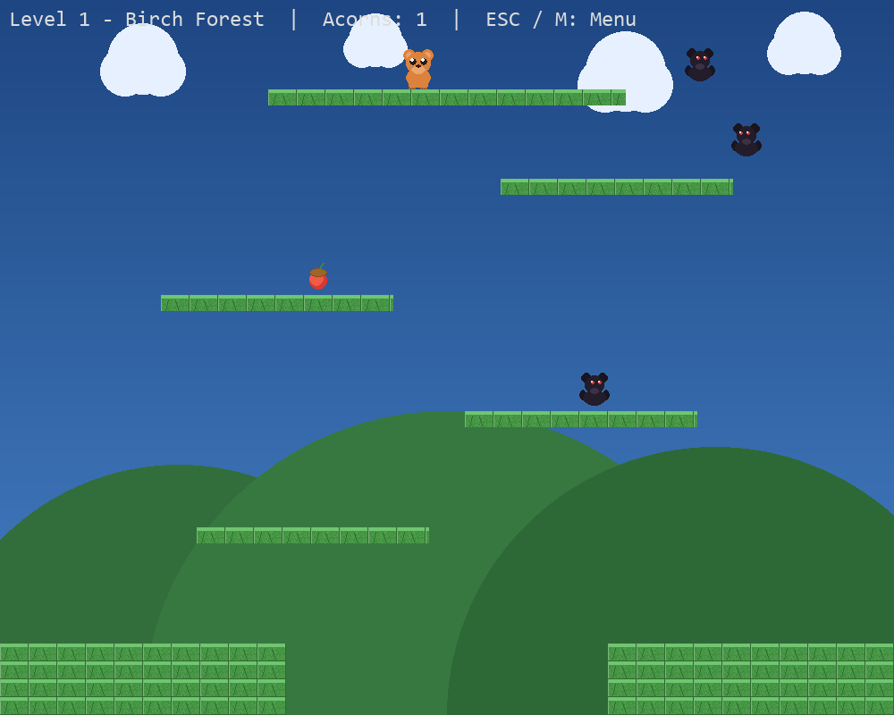

#### exsample_pack
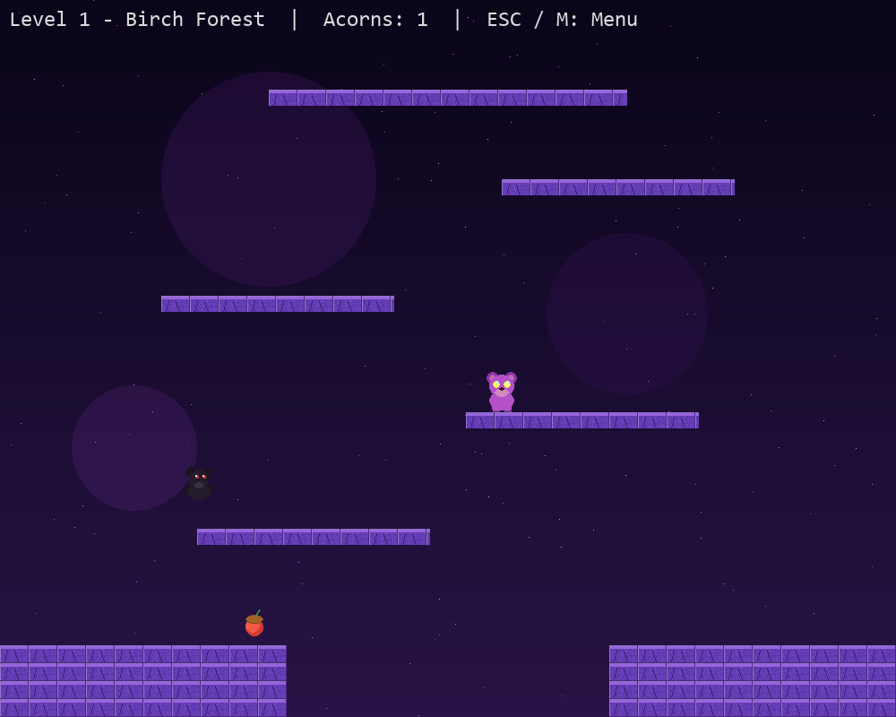

#### new_pack
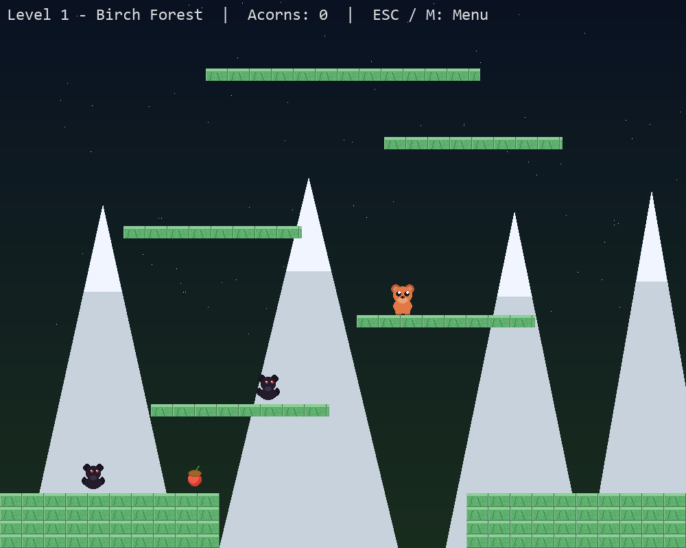

### Extra Gameplay Screenshots (Not Tagged by Pack)

| Screenshot | Screenshot |
|---|---|---|
| 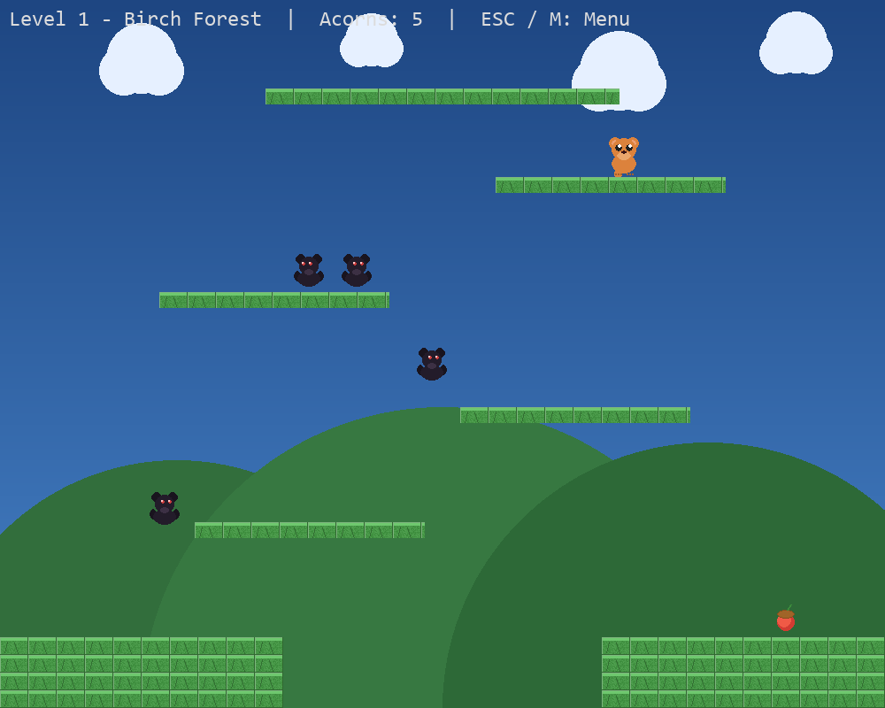 | 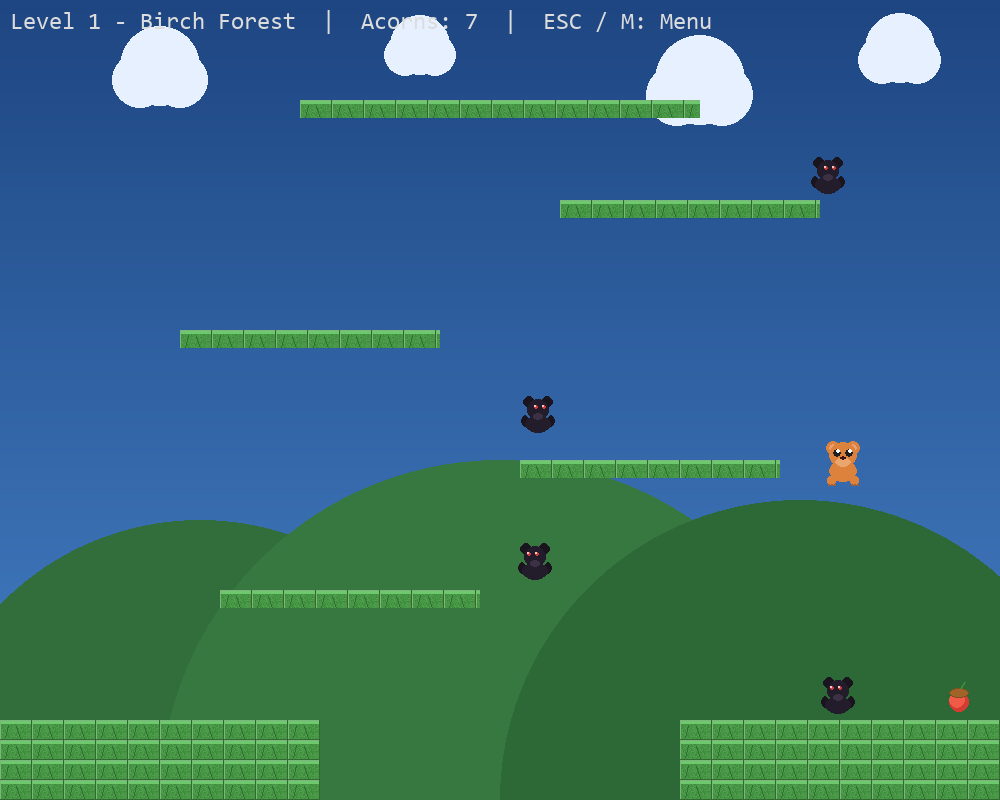 |
| 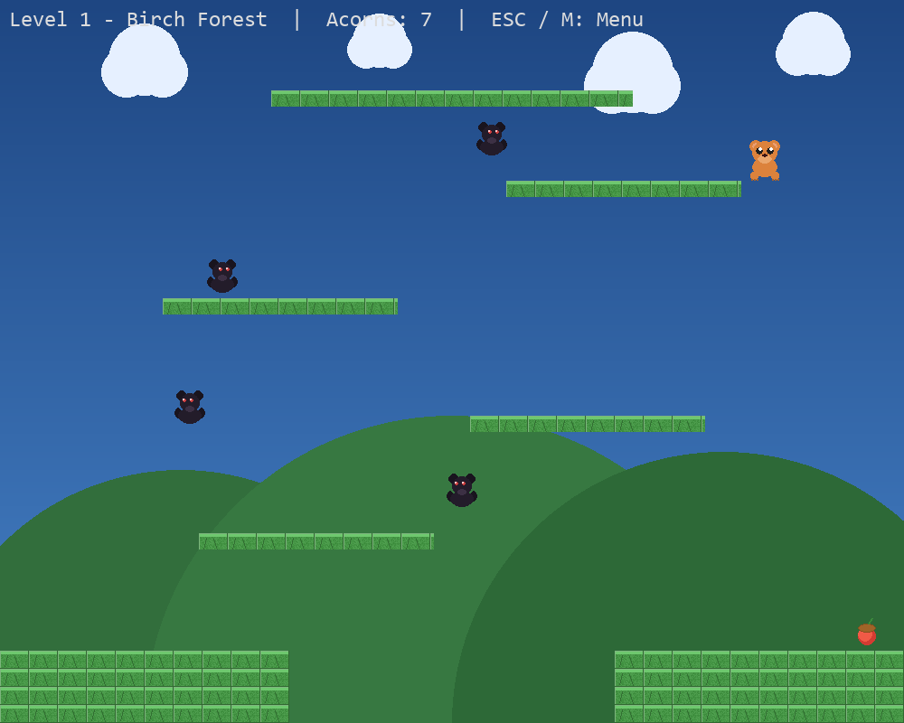 | 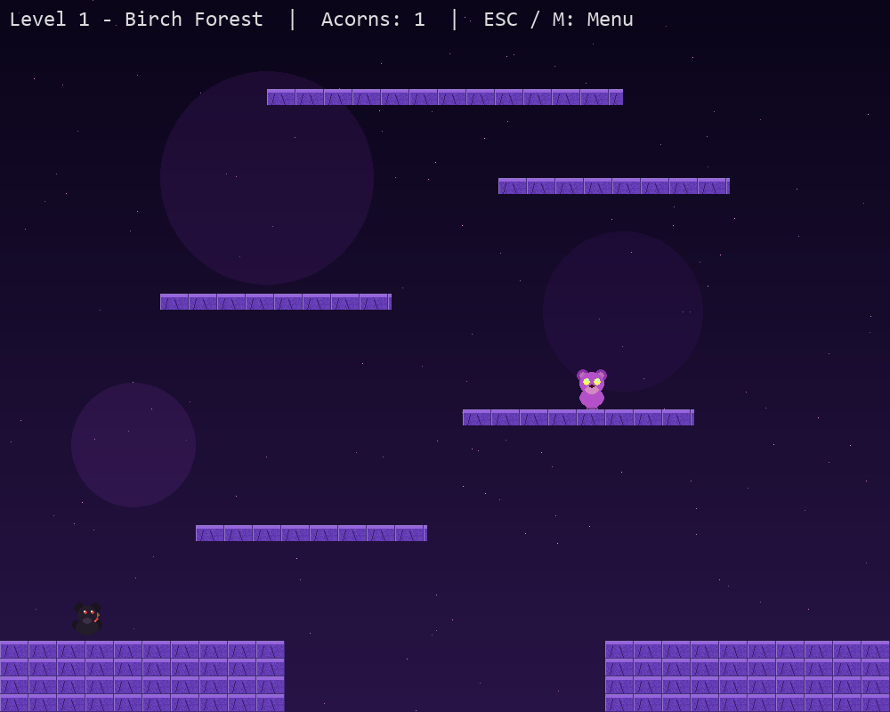 |
| 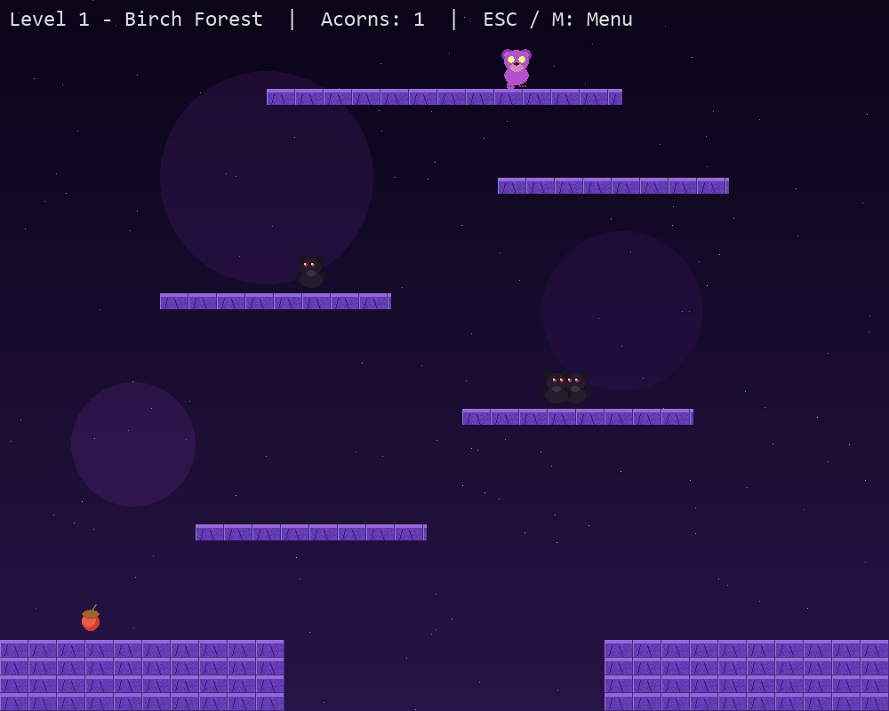 | 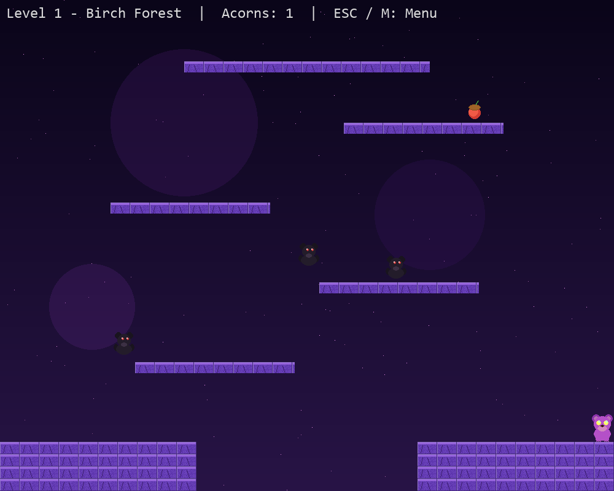 |
| 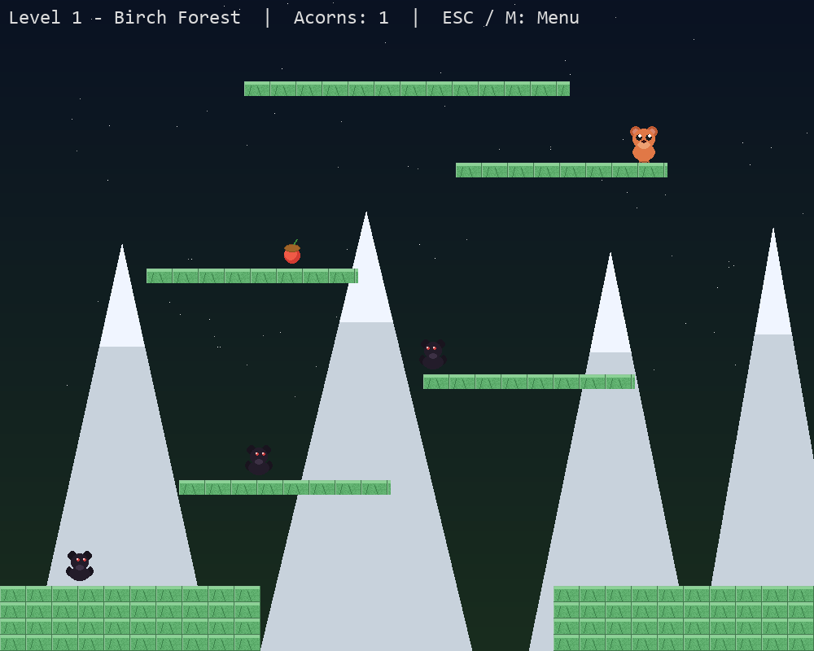 | 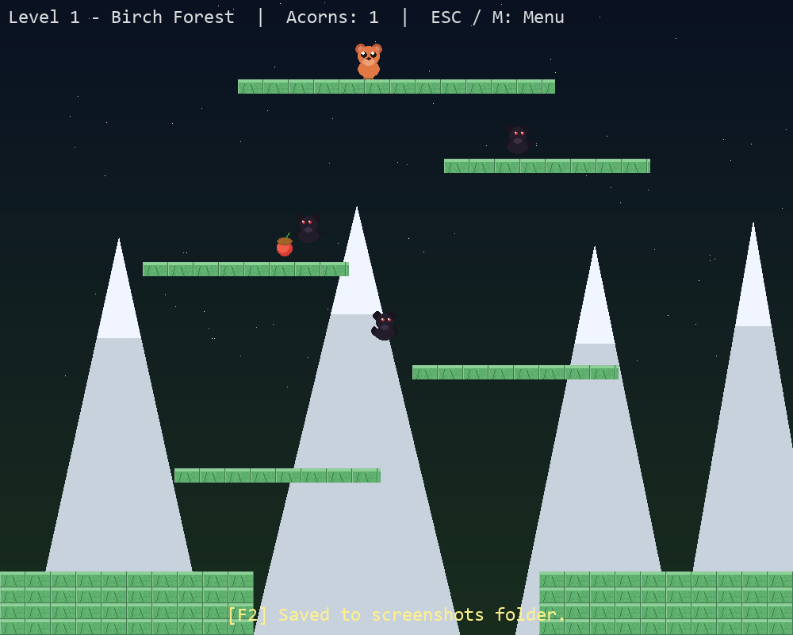 |
| 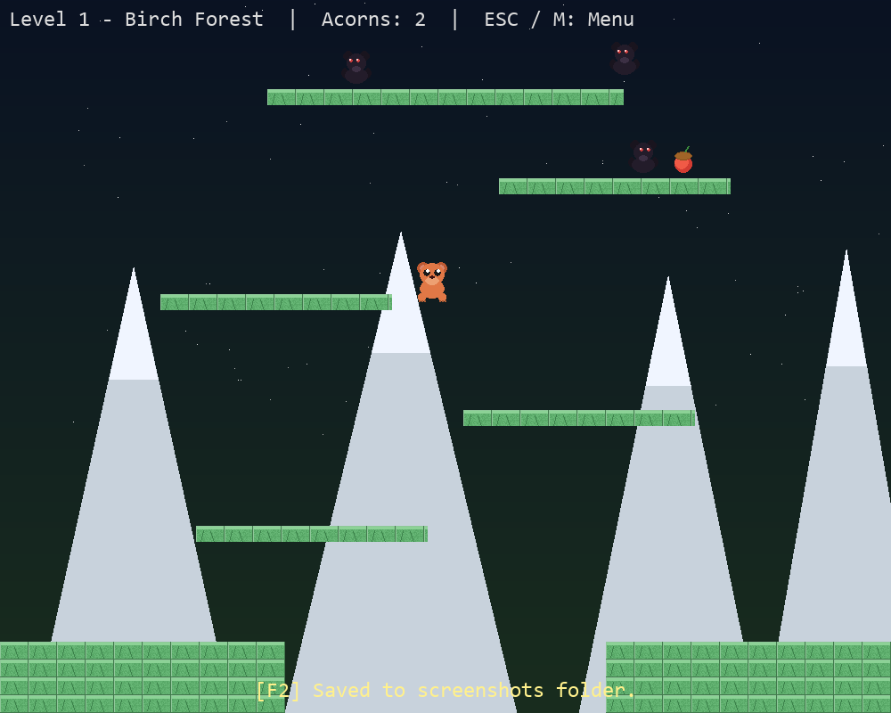 |  |

